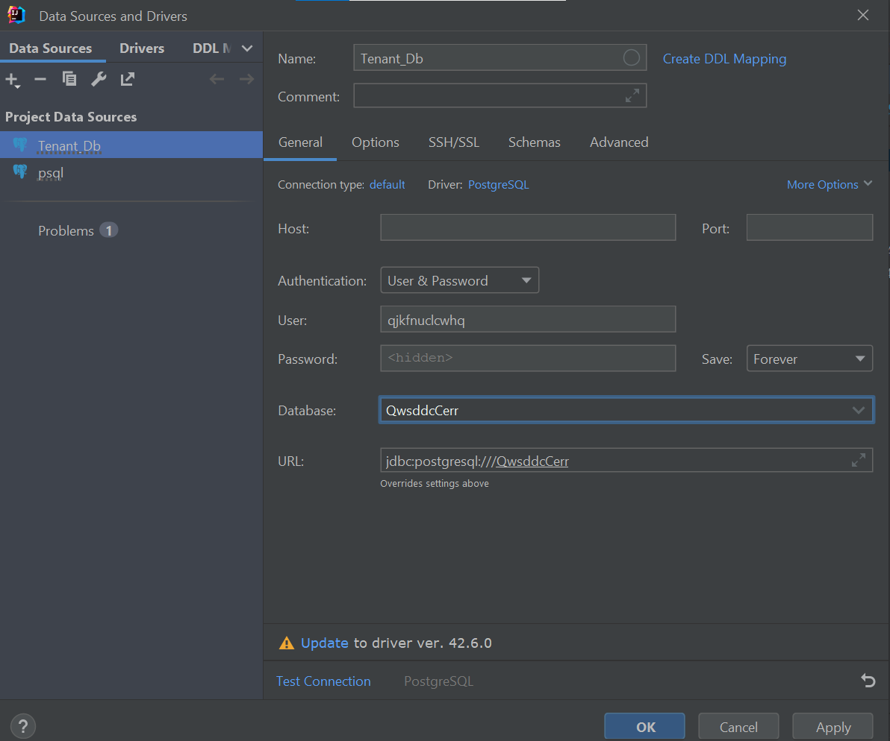
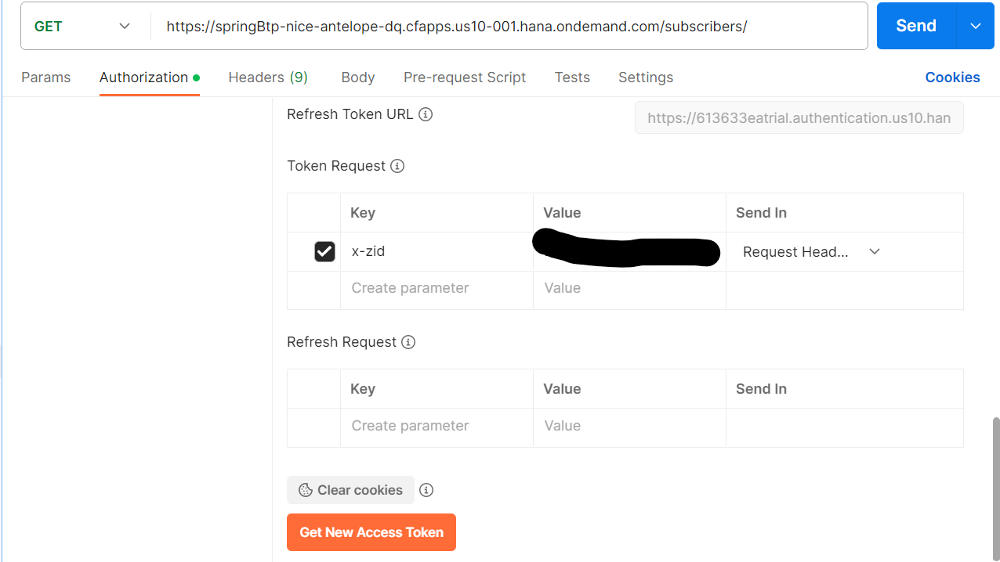

# spring-boot-REST-API-mutlitenancy-app

## Description

This is a test project about implementing Java backend microservices on SAP BTP Cloud
Foundry Platform.

## Project details

* [Guide to developing cloud applications using SAP Cloud Platform and Cloud Foundry.](https://habr.com/ru/companies/sap/articles/350690/)\
* JDK - Sapmachine 11.0.20
* Node v18.17.0
* Npm v9.6.7
* Spring-Boot Crud operations
* Deployment on Cloud Foundry (SAP BTP)
* O-Auth 2.0 protocol (XSUAA service)
* SaaS multi-tenant application (Schema isolation), saas-registry service

## [Create application with Java and Buildpacks](https://developers.sap.com/tutorials/btp-cf-buildpacks-java-create.html#335aa6d6-211f-4b52-b5b3-b6f1b516e728)

* Simple Spring-Boot application with one GET-endpoint. This app is triggered through a web
  microservice (application router).
* Application will set authentication checks and an authorization role to access your web
  application.

### XSUAA authorisation service:

* cf create-service xsuaa application <xsuaa-service_name> -c xs-security.json - create and bind
  service
* cf unbind-service 'application' <xsuaa-service_name> - unbind service
* cf delete-service '<xsuaa-service_name>' - delete service

### Build project

1. In 'web' directory run commands to create package.json and add approuter service:
    * npm install
    * npm install @sap/approuter --save
2. In root directory run:
    * mvn clean install

### Deploy application to SAP BTP

1. Set the Cloud Foundry API endpoint for your subaccount on SAP BTP:
    * cf api https://api.cf.us10-001.hana.ondemand.com
    * cf login
2. Deploy application:
    * cf push

### [Using Postman to test Api with XSUAA](https://blogs.sap.com/2020/03/02/using-postman-for-api-testing-with-xsuaa/)

1) Get all environment variables of you application:
    * cf env <application_name>

2) Note values:
    * ACCESS_TOKEN_URL = VCAP_SERVICES.<xsuua_name>.credentials.url
    * CLIENT_ID = VCAP_SERVICES.<xsuua_name>.credentials.clientsecrid
    * CLIENT_SECRET = VCAP_SERVICES.<xsuua_name>.credentials.clientsecret
    * XSAPPNAME = VCAP_SERVICES.<xsuua_name>.xsappname
    * SCOPE = XSAPPNAME.scope (Can find in your xs-security.json)

3) Postman:
    * Open Postman
    * Create GET_REQUEST
    * Insert link of the request (https://api.cfapps.us10-001.hana.ondemand.com/getBook)
    * In Authorization tab select OAUTH 2.0 :
        * Grant Type: 'Password credential'
        * Access Token URL = ACCESS_TOKEN_URL/oauth/token
        * Client ID = CLIENT_ID
        * Client Secret = CLIENT_SECRET
        * Scope = SCOPE

## [Add Multi-tenancy](https://developers.sap.com/tutorials/cp-cf-security-xsuaa-multi-tenant.html)

* [Add Multi-tenancy (2)] (https://blogs.sap.com/2021/12/24/multitenancy-develop-and-register-multitenant-application-to-the-sap-saas-provisioning-service-in-cloud-foundry/)

### Add SaaS-registry

<details><summary> Description </summary> 

1. Create config.json for Saas-registry:

 ```
   {
   "xsappname":"application",
   "appUrls": {
   "onSubscription" : "https://application.cfapps.eu10.hana.ondemand.com/callback/v1.0/tenants/{tenantId}"
   },
   "displayName" : "Application MTA",
   "description" : "Application MTA sample application",
   "category" : "Custom SaaS Applications"
   }
```

2. Make some changes in xs-security.json:

```
   tenant-mode: shared
   oauth2-configuration: {
     "token-validity": 86400,
     "refresh-token-validity": 2592000,
     "redirect-uris": [
     "https://*.cfapps.us10-001.hana.ondemand.com/**"
     ]
     }
```

3. Unbind and delete xsuaa service:
    * cf unbind-service <app_name> <xsuaa_service_name>
    * cf unbind-service <approuter_name> <xsuaa_service_name>
    * cf delete-service <xsuaa_service_name>

4. Create xsuaa instance:
    * cf create-service xsuaa application <xsuaa_service_name> -c xsuaa/xs-security.json
    * cf create-service saas-registry application <saas-registry_name> -c saas-config/config.json

5.Create Rout for consumer subaccount:

* cf map-route <aprouter_name> cfapps.us10-001.hana.ondemand.com --hostname
  consumer-tenant-ap25-approuter-product-list-ap25

</details> 

## [Tenant-Aware Persistency](https://blogs.sap.com/2017/12/20/deep-dive-6-with-sap-s4hana-cloud-sdk-extend-your-cloud-foundry-application-with-tenant-aware-persistency/)

### [Spring-Boot-REST-API-Mutlitenancy-App](https://github.com/Ragimzade/Spring-Boot-REST-API-Mutlitenancy-App) - Multitenancy Sap Btp

### [Spring-Boot-REST-API-Mutlitenancy-App-MTA](https://github.com/SergeichykAndrei/btpapp/tree/master) - Multitenancy Sap Btp (MTA.yml)

## Remote Debug

### Links

* [Debugging Java Web Applications on SAP Business Technology Platform](https://help.sap.com/docs/btp/sap-business-technology-platform/debug-java-web-application-running-on-sapmachine?locale=en-US)
* [Remote debug on CloudFoundry](https://blogs.sap.com/2019/07/24/remote-debugging-on-cloud-foundry/)

### Debug by hand:

<details><summary> Description </summary> 

1. Login to Cloud Foundry:

```
cf login -a https://api.cf.sap.hana.ondemand.com (Canary Landscape).
```

2. Navigate to your space where your application is deployed

```
cf target -o <organisation name> -s <space name>
```

3. Enable ssh-tunnel for the application:

```
cf enable-ssh <application name>
```

4. Restage your application:

```
cf restage <application name>
```

6. Open ssh-tunnel:

```
cf ssh <app_name>
```

7. Run this command:

```
app/META-INF/.sap_java_buildpack/sap_machine_jre/bin/jcmd 7 VM.start_java_debugging
exit
```

8. After successfully restaging the application run the below command

```
cf ssh -N -T -L 8000:localhost:8000 <application name>
```

10. [Config remote debug configuration](https://blogs.sap.com/2019/07/24/remote-debugging-on-cloud-foundry/)

</details> 

## Locally connection to Cloud Foundry PSQL instance

<details><summary> Description </summary> 

1. Enable ssh-tunnel for the application:

```
cf enable-ssh <application name>
```
3. Restart your app

4. Create a service key for your service instance using the cf create-service-key command:

```
cf create-service-key MY-DB EXTERNAL-ACCESS-KEY
```

5. Retrieve your new service key using the cf service-key command:
   NOTE:
    * dbname;
    * hostname;
    * port;
    * username;

```
cf service-key MY-DB EXTERNAL-ACCESS-KEY
```

6. Configure your SSH tunnel:
    * 63305 - any available local port
    * port, hostname - from previous step

```
cf ssh -L 63305:<hostname>:port <app_name>
```



</details>

## Mutlitenancy POSTMAN testing

<details><summary> Description </summary> 

1. Crete request (GET, POST, PUT, DELETE) to your application :
   > https://application.hana.ondemand.com/request/
2. Do the same steps (exclude SCOPE) [Using Postman to test Api with XSUAA](#using-postman-to-test-api-with-xsuaa)
   Before the token generation you need to add "x-zid" header and value of this header is tenantId of consumer subaccount:
   
3. You get token for you current tenant and use it.

### Note

You can parse your token by [JWT.io](https://jwt.io), and check "x-zid" section to make sure that you have correct tenantId.
   
</details>

## MTA

If you already had previously deployed services and applications, clean them up before starting the MTA deployment in the following order:

  * delete subaccounts
  * delete regestry-service
  * delete approuter and reporting applications
  * delete xsuaa service

## Deploy

* Install the MultiApps CF CLI Plugin:

> cf add-plugin-repo CF-Community https://plugins.cloudfoundry.org
> cf install-plugin multiapps

* Deploy the MTA:

> cd "path_tp_mta"

> cf deploy ./

* To check the application, execute:

> cf apps

* To check the service, execute:

> cf services

[Difference between manifest.yml and mta.yml](https://answers.sap.com/questions/12689412/cloud-foundry-difference-between-mtayaml-and-manif.html)
[MTA file syntax](https://help.sap.com/docs/SAP_HANA_PLATFORM/4505d0bdaf4948449b7f7379d24d0f0d/4050fee4c469498ebc31b10f2ae15ff2.html#resources)
[Deploy Multitarget Application](https://developers.sap.com/tutorials/btp-cf-deploy-mta.html)

## Helpful Links

* [Sapient AI - plugin for generation tests](https://plugins.jetbrains.com/plugin/21709-sapient-ai-test-coder/features)
* [Fundamentals of Multitenancy in SAP BTP](https://blogs.sap.com/2022/08/27/fundamentals-of-multitenancy-in-sap-btp/)
* [SAP BTP – Security – OAuth 2.0 – Understanding Token Exchange](https://blogs.sap.com/2022/02/22/sap-btp-security-oauth-2.0-understanding-token-exchange/)